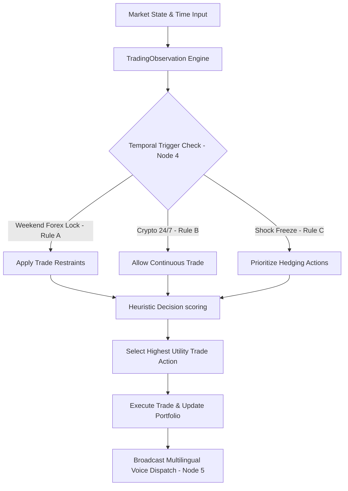

GlobalSentinel-V3: Autonomous Multilingual Trading Agent
GlobalSentinel V3 is a production-grade, time-aware compliance and autonomous algorithmic trading agent designed for multi-asset terminals. Inspired by rule-based simulation engines, GlobalSentinel V3 evaluates real-time market data, scores potential actions using custom heuristics, and auto-executes trade decisions (Buy, Sell, Hedge, Hold) under strict temporal regulatory rules (e.g., weekend locks, geopolitical freeze parameters).
The system also includes a wrapper to deploy the engine as a live, interactive **Telegram Bot** that broadcasts formatted trading logs and synthesizes localized voice disclaimers across multiple target languages.
---
## 🌟 Features
*   **Node 4: Automated Temporal Trigger Engine:** Computes the live server day and applies rule-based constraints (Rule A: Weekend Forex lock, Rule B: Crypto 24/7 matrix, Rule C: Geopolitical weekend risk freeze).
*   **Heuristic Utility Decision Matrix:** Evaluates potential trading actions (`BUY`, `SELL`, `HEDGE`, `HOLD`) and assigns utility scores dynamically based on portfolio assets, cash levels, and market status.
*   **Real-time External API Sourcing:** Integrated with public, no-key endpoints from Coinbase (for live BTC/ETH rates) and Open Exchange Rates (for 25 fiat corridors) with graceful offline fallback layers.
*   **Node 5: Multilingual Audio Broadcast Engine:** Generates and plays synthesized Text-to-Speech (TTS) disclaimers and action logs in 9 target languages: English, Urdu, Arabic, German, Russian, Spanish, Swahili, Chinese, and Turkish.
*   **Live Interactive Telegram Bot:** Responds to terminal commands (e.g., `/forex`, `/crypto`, `/stock`, `$shock`) with clean markdown logs and matching synthesized audio voice notes.
*   **Render Compliance Keep-Alive:** Implements a lightweight HTTP server to satisfy port binding for 24/7 continuous deployment on free cloud tiers.
---
## 🛠️ How It Works

### 1. The Observation & State Resolution
The agent resolves the exact date, day, and risk parameters. It fetches live spot rates and normalizes them into a `TradingObservation` object.
### 2. Heuristic Valuation Loop
Decisions are evaluated using a custom utility scoring algorithm:
$$\text{Utility Score} = \text{Base Score} - \text{Temporal Penalties} + \text{Portfolio Adjustments} + \text{Risk/Volatility Boosts}$$
*   Forex trades on Saturdays automatically receive an extreme utility penalty ($-10,000$) to prevent weekend violations.
*   Hedging receives a massive boost ($+8,000$) during anomaly and geopolitical shock events.
---
## 🚀 Setup & Deployment Instructions
### 1. Running Locally
Clone this repository and install dependencies:
```bash
pip install -r requirements.txt
```
Run the default automated simulation scenario testing:
```bash
python autonomous_sentinel.py
```
### 2. Kaggle Notebook Integration
1. Create a new notebook on Kaggle.
2. Turn the **Internet** option to **ON** in the right-side settings panel.
3. Paste the contents of `autonomous_sentinel.py` into a single code cell.
4. Click **Run All** and select **Save Version** as a *Save & Run All (Commit)* version.
5. Share the notebook as **Public** to obtain the shareable link.
### 3. Deploying the Telegram Bot to Render.com
1. Message **@BotFather** on Telegram and create a new bot to receive your `TELEGRAM_TOKEN`.
2. Create a new **Web Service** on **Render.com** and link this GitHub repository.
3. Apply the following configurations on Render:
   *   **Runtime:** `Python`
   *   **Build Command:** `pip install -r requirements.txt`
   *   **Start Command:** `python telegram_bot.py`
4. Add the following **Environment Variable** under Advanced Settings:
   *   **Key:** `TELEGRAM_TOKEN`
   *   **Value:** `YOUR_TELEGRAM_BOT_TOKEN`
5. Click **Deploy Web Service**.
